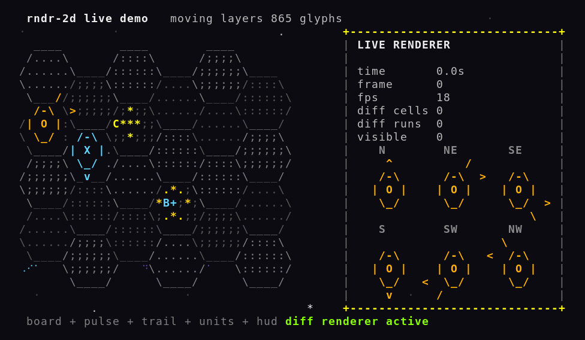

# rndr-2d

Terminal-first 2D rendering for games that draw with text.

`rndr-2d` gives you a small rendering model for CLI games: cells with style,
mutable surfaces, reusable sprites, scene composition, ANSI output, hex-grid
helpers, and braille-backed dense layers for art and effects.



Early project. The core model is in place and already useful; the API will
still move as real game integrations push on it.

## What You Get

- `Cell`, `CellStyle`, and color primitives
- mutable `Surface` buffers and immutable `Sprite` rasters
- explicit scene/layer composition
- full-frame ANSI rendering and diff rendering
- hex-grid projection, labels, scalable hex layouts, and six-way hex facing
- braille dense rendering for text-mode effects, silhouettes, and terrain detail
- deterministic helpers that are easy to snapshot and test

`rndr-2d` is not a widget toolkit. It does not handle input, layout management,
or game loops. The job here is narrower: make terminal game rendering feel like
rendering work, not string assembly.

## Current Shape

The library works well for:

- hex boards and tactical maps
- layered unit rendering
- HUD panels and status overlays
- projectile trails, pulses, scanlines, and similar effects
- denser art layers built with Unicode braille cells

Parts that are still intentionally missing:

- terminal input handling
- frame pacing helpers in the core library
- arbitrary-angle rotation
- full grapheme-width handling beyond single-cell glyphs

## Quick Start

The package is not published to npm yet. Right now the repo is the product.

```bash
pnpm install
pnpm check
pnpm demo:zoo
pnpm demo:live
pnpm demo:dense
pnpm demo:png-braille
```

Useful review commands:

- `pnpm demo:zoo`: interactive feature zoo
- `pnpm demo:live`: animated renderer with diff updates
- `pnpm demo:dense`: coarse vs braille comparison
- `pnpm demo:png-braille`: image-to-braille proof path
- `pnpm review:artifacts`: writes text review files to `docs/generated/`
- `pnpm media:readme`: regenerates the README GIF and poster image

## Example

```ts
import {
  Sprite,
  Surface,
  ansiColor,
  composeScene,
  createCell,
  createHexGridSprite,
  drawHexLabel,
  renderSurfaceAnsi
} from "rndr-2d";

const board = createHexGridSprite({
  board: { cols: 4, rows: 3 },
  fill: ({ q, r }) => ((q + r) % 2 === 0 ? "." : ":")
});

const unit = Sprite.fromText({
  lines: [" /^\\\\ ", "<@@>", " \\\\/ "],
  transparentGlyphs: [" "],
  style: {
    foreground: ansiColor(214),
    bold: true
  }
}).rotateQuarterTurns(1);

const frame = composeScene({
  size: { width: 34, height: 18 },
  background: createCell(" "),
  layers: [
    {
      name: "board",
      z: 0,
      items: [{ source: board, position: { x: 0, y: 0 } }]
    },
    {
      name: "unit",
      z: 1,
      items: [{ source: unit, position: { x: 10, y: 5 } }]
    }
  ]
});

drawHexLabel(frame, {
  coord: { q: 1, r: 1 },
  text: "A1"
});

process.stdout.write(renderSurfaceAnsi(frame));
```

## Braille Layers

Braille rendering is the dense path in `rndr-2d`. One terminal cell becomes a
`2x4` micro-grid, which lets you draw smoother lines, softer effects, and more
shape inside the same screen space.

That does not mean every layer should be braille. The split that works:

- use `BrailleSurface` for terrain texture, fog, glows, silhouettes, trails, and atmosphere
- keep the board grid, labels, HUD, and other readability-heavy layers on normal `Surface` or `Sprite`
- stay in cell coordinates when you can, then drop to dot coordinates only for fine shapes

```ts
import {
  BrailleSurface,
  brailleDotPointFromCell,
  rgbColor
} from "rndr-2d";

const effects = new BrailleSurface(boardWidth, boardHeight, {
  activationThreshold: 0.18
});

effects.fillCellRect(
  { x: 0, y: 0, width: boardWidth, height: boardHeight },
  { value: 0.08, style: { foreground: rgbColor(32, 74, 96) } }
);

effects.drawCellLine(
  { x: 2, y: 8 },
  { x: 18, y: 4 },
  { value: 0.35, style: { foreground: rgbColor(84, 191, 224) } }
);

effects.fillCircle(
  brailleDotPointFromCell({ x: 10, y: 6 }, "center"),
  7,
  { value: 0.28, style: { foreground: rgbColor(96, 58, 160) } }
);
```

## Hex Boards

Hex rendering is a first-class part of the library right now because it is the
first hard consumer. The public hex exports include:

- parametric pointy-hex layouts
- projected centers and anchors
- label helpers
- scalable hex templates
- content boxes and full content-row spans
- six-way facing helpers
- compatibility helpers for long-form facing names such as `northEast`

The fastest manual check is `pnpm demo:zoo`, then switch to the hex lab page.

## Docs

- [docs/architecture.md](docs/architecture.md): rendering model and public boundaries
- [docs/architecture-illustrated.md](docs/architecture-illustrated.md): ASCII diagrams
- [docs/roadmap.md](docs/roadmap.md): near-term direction
- [docs/evals.md](docs/evals.md): invariants and test bar
- [docs/research.md](docs/research.md): outside references and notes

## Development

Rules that matter in practice:

- keep the core rendering model pure
- treat ANSI as a backend detail
- add small primitives instead of giant abstractions
- prefer reusable engine features over game-local shortcuts
- add tests when behavior changes

The first consumer is `agent-game`, and `agent-battle` is the next real port.
That pressure is useful. It keeps the API honest.
